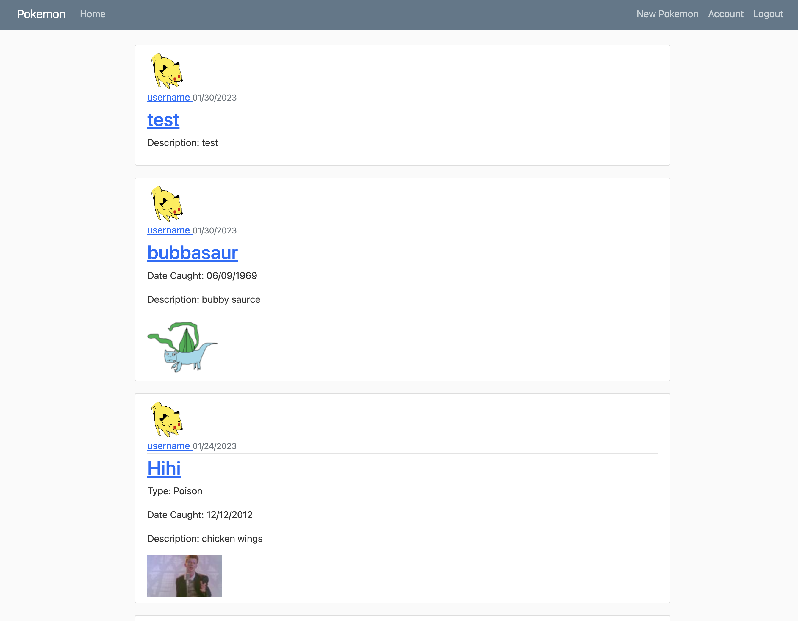
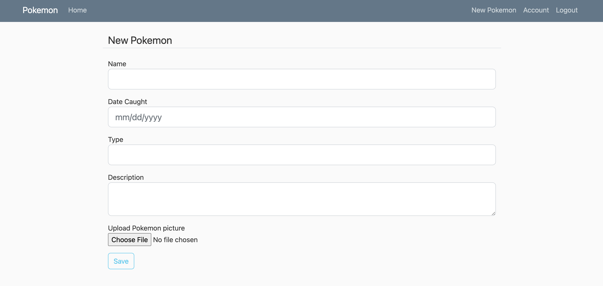

# crispy-pokemon
Web application that allows users to create pokemon.

[TOC]

## Technology Stack

* Python
* Flask framework
* HTML/CSS/Bootstrap

## How To Run

1. Create a python environment
2. pip install requirements
3. Run app

        python run.py

## Gallery

## License
[MIT](LICENSE) © Christine Han
